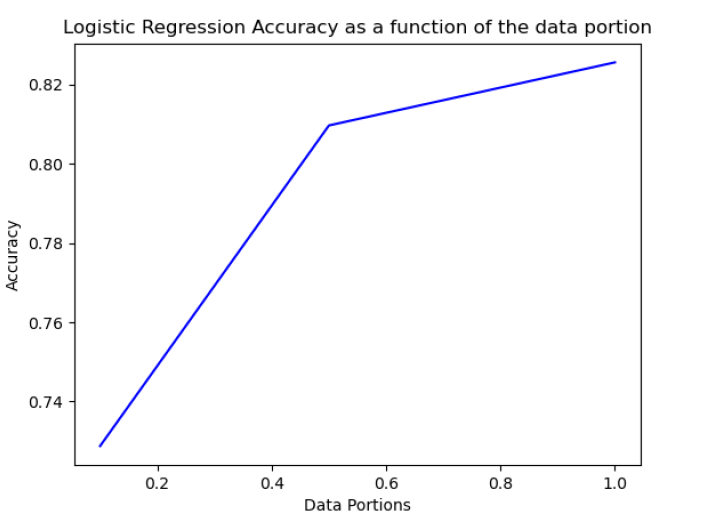
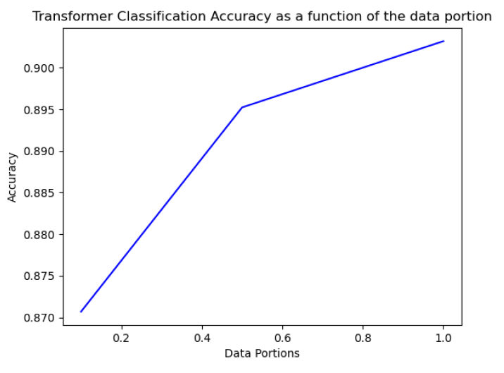

# Text Classification with Transformers

This is a Python exercise that demonstrates the use of simple Transformer models for text classification, using a subset of the 20newsgroups dataset. We will compare three different models: two common uses of transformers and a simple linear model.

## Installation

To run this project, you will need to have the transformers and scikit-learn packages. Please follow the installation instructions provided in the following links:

- [transformers](https://huggingface.co/docs/transformers/installation)
- [scikit-learn](https://scikit-learn.org/stable/install.html)

## Data

The 20newsgroups dataset contains approximately 18,000 news posts on 20 different topics. For this exercise, we will limit ourselves to the following four topics: `comp.graphics`, `rec.sport.baseball`, `sci.electronics`, and `talk.politics.guns`. You can find more information about the dataset [here](https://scikit-learn.org/stable/datasets/real_world.html#the-20-newsgroups-text-dataset).

## Classification Tasks

### Log-linear Classifier

In this task, we will use a Log-linear classifier with a Logistic Regression model and TFIDF vectors for encoding the text. We will run the classification for three different portions of the data: all data (portion=1), half the data (portion=0.5), and 10 percent of the data (portion=0.1). 

To run the classifier, refer to the `pretraining_transformers.py` file provided in this repository. For more information about TFIDF and Logistic Regression, see the following links:

- [LogisticRegression](https://scikit-learn.org/stable/modules/generated/sklearn.linear_model.LogisticRegression.html#sklearn.linear_model.LogisticRegression)
- [TfidfVectorizer](https://scikit-learn.org/stable/modules/generated/sklearn.feature_extraction.text.TfidfVectorizer.html)

### Finetune Transformer Model

In this task, we will finetune a Transformer model with a SequenceClassification head and an appropriate tokenizer. We will use the pretrained `distilroberta-base` model for five epochs with a learning rate of 5e-5 and a batch size of 16. We will repeat the process for the three cases in the previous task and plot the model accuracy results as a function of the portion of the data.

To finetune the Transformer model, refer to the `pretraining_transformers.py` file provided in this repository. For more information about the Trainer and SequenceClassification, see the following links:

- [Trainer](https://huggingface.co/docs/transformers/quicktour#trainer-a-pytorch-optimized-training-loop)
- [SequenceClassification](https://huggingface.co/transformers/model_doc/distilroberta.html#distilrobertaforsequenceclassification)

### Zero-Shot Classification

In this task, we will use the pretrained `cross-encoder/nli-MiniLM2-L6-H768` model with the `zero-shot-classification` pipeline for zero-shot classification. We will report the accuracy we get.

To run the zero-shot classification, refer to the `pretraining_transformers.py` file provided in this repository. For more information about zero-shot classification, see the following link:

- [ZeroShotClassification](https://huggingface.co/docs/transformers/main_classes/pipelines#transformers.ZeroShotClassification)

## Model Comparison

### Which model had the highest accuracy?
We evaluated three different models: a Log-linear classifier, a finetuned Transformer model, and a zero-shot classification model. After testing each model on different portions of the 20newsgroups dataset, we found that the finetuned Transformer model had the highest accuracy overall. 
The models' performance describes using a graph representing the model's accuracy as a function of the data portion:
1. Log-linear Classifier:  

2. Finetune Transformer Model:  

3. Zero-Shot Classification:  The accuracy of the model was: 0.771

### Which model was the most sensitive to the size of the training set?
Our results showed that the Log-linear classifier was the most sensitive to the size of the training set, with its accuracy decreasing as the size of the training set decreased. In contrast, the accuracy of the finetuned Transformer model remained relatively consistent across all training set sizes, and the zero-shot classification model was not affected by the training set size.

### Pros and cons of the zero-shot model
Pros:
* The zero-shot classification model does not require fine-tuning on a specific task, which can save time and resources.
* The model can be used to classify inputs into a large number of categories, even ones that were not seen during training.

Cons:
* The zero-shot classification model may not perform as well as a model specifically trained for a particular task.
* The model relies on the set of possible labels provided by the user, which may be limited or biased.

## Conclusion
The project provides a good introduction to text classification using Transformer models and showcases the performance of different models in various scenarios. Feel free to modify the project code and experiment with different parameters and models to improve the performance.