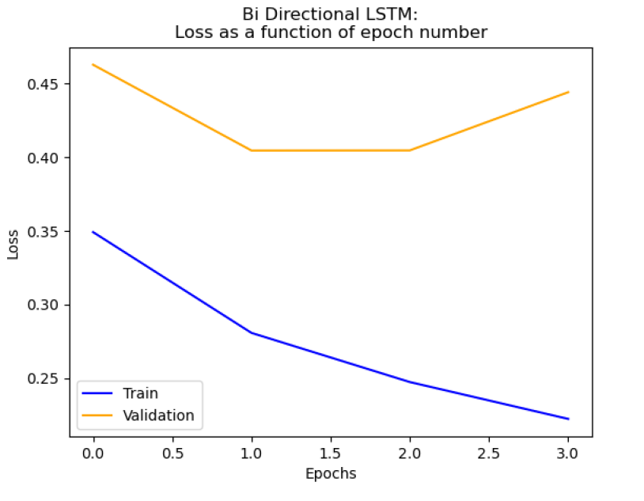
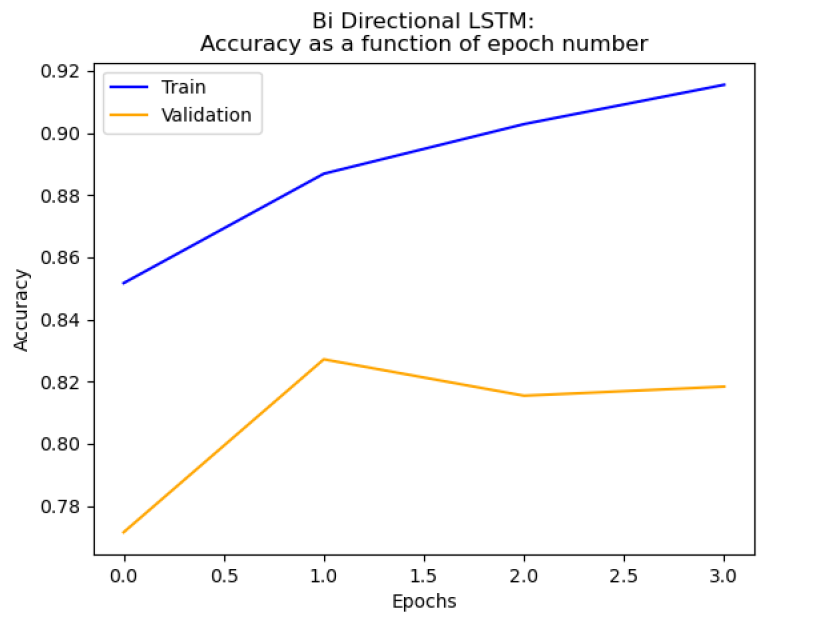

# Sentiment Analysis and RNNs

## Introduction
This project aims to perform binary sentiment analysis on movie reviews using the Sentiment Treebank dataset by Stanford. The dataset consists of sentences from movie reviews with their corresponding sentiment values ranging from 0 (most negative) to 1 (most positive).

## Dataset
In this project, I used the Sentiment Treebank dataset provided by Stanford, which consists of sentences, taken from movie reviews, and their sentiment value. For our binary classification task, we consider a sentiment value to be positive if it's ≥ 0.6 and negative if it's ≤ 0.4. We discard examples with a sentiment that is between 0.4 and 0.6. The dataset contains sentences presented as trees, where each sub-tree defines a subphrase and has its own sentiment value (as well as each word).

All models were trained using the full sentences, as well as the sub-sentences. We provided the `data_loader.py` file to load the data (both sentences and sub-sentences, as well as their binary label), and split the data into train, validation, and test sets. We used an 80%, 10%, 10% split of the original dataset for the train, validation, and test sets respectively.

I also provided code for extracting special subsets of examples out of the test set on which you can examine the model's performance. Those subsets include negated polarity and rare words.

## Data Preparation
We provided two utility classes, `DataManager` and `OnlineDataset`, for preparing the data for training in the PyTorch framework. The `DataManager` class loads the dataset sentences with their labels and creates `OnlineDataset` instances which follow the PyTorch Dataset API, using some functionalities to convert the lists of tokens to valid inputs for each model. It also creates PyTorch DataLoaders which are used to iterate over batches of examples from the `OnlineDatsets` as PyTorch Tensors.

## Models
We implemented 3 different models:

1. Simple log-linear model: This model uses a simple one-hot embedding for the words in order to perform the task. The input to the model is the average over all the one-hot embeddings of the words in the sentence. After receiving the average embedding, this model operates a single linear layer, followed by a sigmoid to predict the sentiment.

2. Word2Vec log-linear model: This model is almost identical to the simple log-linear model, except it uses pre-trained Word2Vec embeddings instead of a simple one-hot embedding. The input to the model is the average over all the Word2Vec embeddings of the words in the sentence. After receiving the average embedding, this model operates a single linear layer, followed by a sigmoid to predict the sentiment.

3. Bi-Directional LSTM model: This model uses an LSTM layer to perform the task. The input to the model is a sequence of word embeddings, where each word is passed through an embedding layer. The LSTM layer outputs the hidden states for each time step, and the last hidden state is used to predict the sentiment.

## Results
First, I will present the Bi-Directional LSTM performance on the validation set, using two graphs:
1. Loss as a function of the epoch number:  
 

2. Accuracy as a function of the epoch number:  

In addition, the performance on the test set, and on the special subsets was:
* The accuracy on the test set was: 0.861
* The loss on the test set was: 0.304
* The accuracy on the negated polarity set was: 0.691
* The accuracy on the rare words set was: 0.80

as expected, the LSTM model has higher accuracy level, and lower loss, compared to the log linear models.
By processing an input in both directions, Bi-Directional LSTM can capture relevant information regrading the sentence context, influenced by the "history" (backward observations) and by the "future" (forward observations).
Furthermore, by preserving a memory cell that can store information over long periods, the LSTM model can deduce relations between the sentence words, regarding their order, in contrast to the log linear models.

## Conclusion
This project provides an implementation of three different models for performing binary sentiment analysis on movie reviews. The results can be improved by tweaking the hyperparameters, pre-processing the data, and using a different set of embeddings. Please refer to the code and the provided examples for more details.
